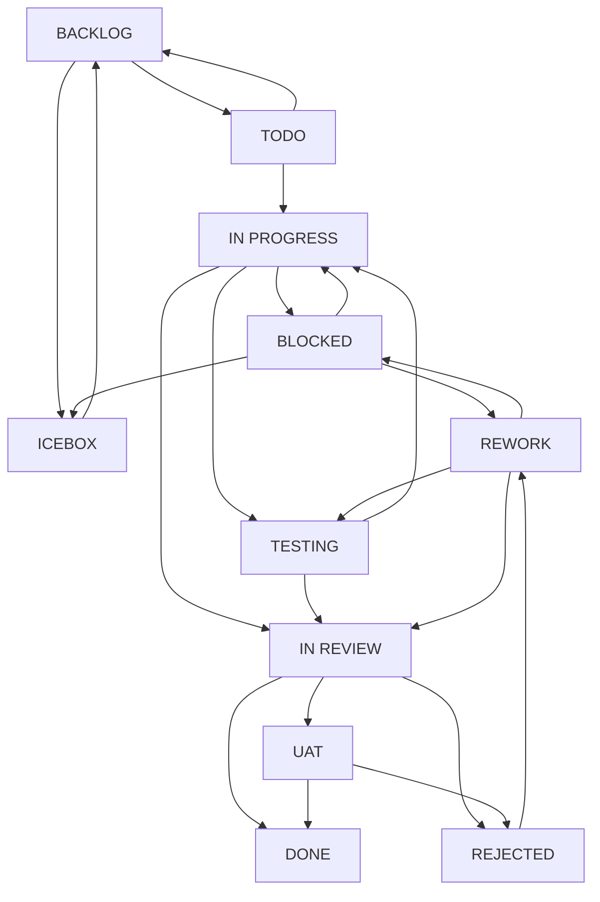

# Obsidian Kanban — AI Development Task Management

> ⚠️ **CRITICAL RULES**:
>
> 1. **Scripts** — run from the project root via the dispatcher: `python <SCRIPT_PREFIX>/kanban.py <command> ...` (NOT `cd ... && python`; list of commands — §10). `SCRIPT_PREFIX` is the first existing one of `.agents/skills/obsidian-kanban/scripts/` / `skills/obsidian-kanban/scripts/` (dev repo) or `obsidian-kanban/scripts/` (standard); determined during onboarding, see ONBOARDING.md → SCRIPT_PREFIX.
> 2. **The board** — edit only through the adapter (`scripts/` for Obsidian; MCP tools for Linear/Trello/GitHub); direct `Edit` of the board file is forbidden.
> 3. **After every card move** — a hard stop and injection of the role checklist: for the Obsidian adapter, `move_card.py` prints it automatically; for external adapters, run `python <SCRIPT_PREFIX>/kanban.py resume "." <slug> --full-checklist` immediately after the MCP move operation.
> 4. **Code verification** — in Claude-style environments use the built-in `Read` + `Grep`; shell commands for file analysis are forbidden. In environments without separate `Read`/`Grep`, use the platform's closest native read/search tools and record this as an environment fallback, not a change to the kanban protocol.
> 5. **CLI columns with spaces** — for Obsidian scripts you can use shell-safe aliases: `IN_PROGRESS` instead of `"IN PROGRESS"` and `IN_REVIEW` instead of `"IN REVIEW"`. This is preferred on Windows/Codex shell wrappers, where nested quotes can break positional arguments.

**Templates** — read when creating files:

- [`templates/board.md`](templates/board.md) — Kanban board for a new project
- [`templates/epic.md`](templates/epic.md) — epic specification
- [`templates/task.md`](templates/task.md) — task / subtask specification
- [`templates/artifact.md`](templates/artifact.md) — artifact (deliverable); `status: draft|actual`; `tags: [category]`

**Agent roles** — read when entering the corresponding status (§5):

- [`agents/README.md`](agents/README.md) — index of all roles
- [`agents/<role>.md`](agents/) — the role's stable entry point: `## Role Knowledge` describes the reusable profile, `## Stage Process` points to the checklist/transitions of the specific column (analyst, planner, developer, researcher, tester, reviewer, uat, debugger, documenter, communicator, archivist)

**References** — read as needed:

- [`references/dashboard.md`](references/dashboard.md) — web dashboard for users without Obsidian
- [`references/task-hierarchy.md`](references/task-hierarchy.md) — task hierarchy and decomposition rules (§4)
- [`references/workflow-contract.md`](references/workflow-contract.md) — runtime contract for columns, gates, hooks, and recovery for the autonomous loop
- [`references/board-format.md`](references/board-format.md) — Kanban board format and task categories (§6)
- [`references/emoji-tags.md`](references/emoji-tags.md) — table of emoji tags and order (§7)
- [`references/metadata.md`](references/metadata.md) — spec YAML template, reminder fields, date format (§8)
- [`references/commands.md`](references/commands.md) — slash-command reference (§11)

---

## 1. Activation and Session Mode

**Startup commands:** `/kanban`, `/tasks`, `/board`

> `/board` combines two functions: if the skill session isn't active yet — it activates it (onboarding below), then shows the board state (§11). `/kanban` and `/tasks` — activation with a summary only.

On activation the agent must:

1. Read **[`ONBOARDING.md`](ONBOARDING.md)** — paths, dependencies, a single startup command.
2. Perform onboarding (§3): determine `SCRIPT_PREFIX` **and** `ADAPTER_TYPE`.
3. Report: `✅ Kanban activated. Workspace: <path>. Adapter: <ADAPTER_TYPE>. Projects: <list>.`

**Active session mode:** after activation the agent **automatically** updates files on every significant action. The user should not have to ask "update the task."

---

## 2. Workspace Structure

```
$WORKSPACE_ROOT/
└── tasks/
    ├── kanban-dashboard.html     ← web dashboard (copied during onboarding)
    ├── <project-slug>.md         ← Kanban board (one file per project, flat)
    ├── specs/
    │   └── <task-slug>.md        ← specs, flat, no nested folders
    └── artifacts/                ← optional: work results (research, reports)
        └── <artifact-slug>.md    ← deliverable per templates/artifact.md; status: draft|actual; tags
```

A spec describes the **process** (lives while the task is in progress); an artifact is the **result** (lives permanently, read by people). The spec references the artifact via a wikilink in the `## Output / Artifacts` section and does not contain it — otherwise the spec bloats and every role operation pays context for reading unnecessary content.

The skill (`obsidian-kanban/`) lives in the skill-plugin infrastructure and is **not copied** into `tasks/` — except for `kanban-dashboard.html`: setup.py copies it from `obsidian-kanban/assets/` into `tasks/` during project initialization so the dashboard sits next to the boards. `check_reminders.py` refreshes the copy on every onboarding. **The canonical source is `assets/kanban-dashboard.html`**: make edits only there; `tasks/kanban-dashboard.html` gets overwritten on the next reminders run.

**Obsidian path rule:** wikilinks are always shortest path, without folders:
`[[task-slug|Title]]`, not `[[tasks/specs/task-slug|Title]]`.
`<artifact-slug>` must differ from any `<task-slug>`: `specs/` and
`artifacts/` live in the same wikilink namespace, and the dashboard indexes them by
basename. If an artifact is needed for task `foo`, name it `foo-report` /
`foo-spec` / `foo-result`, but not `foo.md`; `kanban.py check` flags such a
collision as ERROR.

**Deliverable outside the task storage:** if the result is a file outside `tasks/` (source of the skill itself or the repository, e.g. an edit to `SKILL.md`/a script), a wikilink to it isn't applicable. In the `## Output / Artifacts` item, add the marker **`outside workspace`** — the linter will skip the exact reference (path+extension) without ERROR. Without the marker, any non-wikilink artifact in storage still produces ERROR (the §2 gate is not relaxed).

---

## 3. Onboarding

> Full protocol — **read [`ONBOARDING.md`](ONBOARDING.md)** before performing any actions.

In brief: `WORKSPACE_ROOT` = `"."`. Onboarding is performed in two steps:

1. **`SCRIPT_PREFIX`** (see ONBOARDING.md → `## SCRIPT_PREFIX`): the first existing one of `.agents/skills/obsidian-kanban/scripts/` / `skills/obsidian-kanban/scripts/` (dev repo) or `obsidian-kanban/scripts/` (standard).
2. **`ADAPTER_TYPE`** (see ONBOARDING.md → `## ADAPTER_TYPE`): determines which PM tool is active (`obsidian`, `linear`, `trello`, …). Loads `adapters/<ADAPTER_TYPE>.md` — the concrete command syntax for the session.

| Situation | Command (Obsidian adapter) |
| -------- | ------- |
| New project (no `tasks/`) | `python <SCRIPT_PREFIX>/kanban.py setup "." <project-slug>` |
| Existing project | `python <SCRIPT_PREFIX>/kanban.py reminders "."` |

> **`reminders` exit 2 is an expected signal, not a failure.** The command returns **exit 2** when the board has items awaiting attention (reminders / stuck in UAT / column overflow). In autonomous/scheduled mode the harness will show this as `<error>Exit code 2` — **do not abort or retry onboarding**: the output is complete and correct, read it and continue. The full list of exit 0/2 conditions is in [`ONBOARDING.md`](ONBOARDING.md) (the single source of truth, not duplicated here).

---

## 4. Task Hierarchy

> Details: [`references/task-hierarchy.md`](references/task-hierarchy.md)

`Epic 🗃️` → `Task 📋` → `Subtask ✅`. Each card is a wikilink to a spec; create via `new_task.py` / `new_epic.py` — not by hand.

**Epic card:** an epic HAS a card on the board; it goes through the same column flow as a task. An epic is moved by the same agent roles as tasks — the analyst starts it, the planner prepares it, the developer takes it into progress. **Closing an epic:** when the documenter closes the LAST child task (all `parentId == epic-slug` in done), they must move the epic to IN REVIEW. An epic doesn't close itself — this is an explicit documenter action.

**Subtask flowId:** `<project>/subtask/<slug>` (not `task`).

---

## 5. Lifecycle and Agent Roles

### Column, Status, and Role Mapping

Each status = one column = one role. When entering a status, read `agents/<role>.md`: first `## Role Knowledge` for the stable rules of the role, then `## Stage Process` / `## Checklist` for the actions of the current column. The role file isn't split into `*-knowledge.md`/`*-process.md` until a separate link migration is done.

| Column                   | `status`      | Agent Role    | Role File                                          |
| ------------------------- | ------------- | ------------- | -------------------------------------------------- |
| `BACKLOG`                 | `backlog`     | Analyst      | [`agents/analyst.md`](agents/analyst.md)           |
| `ICEBOX`                  | `icebox`      | Archivist    | [`agents/archivist.md`](agents/archivist.md)       |
| `TODO`                    | `ready`       | Planner   | [`agents/planner.md`](agents/planner.md)           |
| `IN PROGRESS`             | `in-progress` | Developer   | [`agents/developer.md`](agents/developer.md)       |
| `IN PROGRESS` (RESEARCH:) | `in-progress` | Researcher | [`agents/researcher.md`](agents/researcher.md)     |
| `BLOCKED`                 | `blocked`     | Communicator  | [`agents/communicator.md`](agents/communicator.md) |
| `TESTING`                 | `testing`     | Tester   | [`agents/tester.md`](agents/tester.md)             |
| `IN REVIEW`               | `review`      | Reviewer       | [`agents/reviewer.md`](agents/reviewer.md)         |
| `UAT`                     | `uat`         | User  | [`agents/uat.md`](agents/uat.md)                   |
| `REJECTED`                | `rejected`    | Debugger      | [`agents/debugger.md`](agents/debugger.md)         |
| `REWORK`                  | `rework`      | Developer   | [`agents/developer.md`](agents/developer.md)       |
| `DONE`                    | `done`        | Documenter  | [`agents/documenter.md`](agents/documenter.md)     |

> **Developer vs Researcher:** if the task title starts with `RESEARCH:` — read [`agents/researcher.md`](agents/researcher.md) instead of `developer.md`. The researcher **must** use WebSearch/deep-research and verify sources — data from the model's memory is not accepted.

> **TESTING vs IN REVIEW:** `testing` — functional check ("does it work"). `review` — quality check ("was it done correctly": DoD, architecture, code style).

### Transition Diagram

Source of truth — `ALLOWED_EXITS` in `scripts/hooks.py`; each directed edge below corresponds to exactly one entry there. Bidirectional transitions are recorded as pairs of one-directional `-->`:



---

## 6. Kanban Board Format

> Format rules, critical patterns, and task categories: [`references/board-format.md`](references/board-format.md). Board template: [`templates/board.md`](templates/board.md).

## 7. Emoji Tags

> Full tag table: [`references/emoji-tags.md`](references/emoji-tags.md)

**Order:** `➕` → `🛫` → `📅` → `⏳` → priority (`🟥`/`🟨`/`🟩`) → `🔁` → `✅`. Set via `set_card_tags.py` — not by hand.

## 8. TaskFlow Metadata

> YAML template, reminder fields, date formats: [`references/metadata.md`](references/metadata.md). Templates: [`templates/task.md`](templates/task.md), [`templates/epic.md`](templates/epic.md).

**Key rules:** `owner` = the task's author; set at creation and not changed on transitions. `status` is set by `move_card.py` automatically — don't touch it manually. `step` is set by `set_step.py`, `itemType` by `set_item_type.py` (command `set-type` / `update --item-type`; don't edit frontmatter by hand — it races with `move_card`). `updatedAt` is updated automatically by mutator scripts. ISO 8601 (`YYYY-MM-DD`) is the only date format.

**Related tasks without blocking:** don't use `dependsOn` / `## Dependencies` for follow-ups, alternative specs, and contextual links. For these, add `## Related` with a wikilink in both specs; `kanban.py check` verifies that the linked spec exists and that the reference is reciprocal. The agent must not rely on memory or a comment about the relationship.

## 9. Agent Protocols

> Details of work within each role are in `agents/<role>.md`: `## Role Knowledge` = stable skills/methodologies/constraints, `## Stage Process` and `## Checklist` = actions for the specific column. Here — only coordination: when and how to hand the task off to the next role.

### Role Cycle (mandatory at every stage)

Any work on a task goes through the same cycle — regardless of role:

```
1. ROLE CHECKLIST: output order — checklist → `=== END OF CHECKLIST ===` marker → transition
   success line → `=== RESUME PACKET ===`. Compact rendering (filters `python ...` lines and bare
   python blocks) is the default for `move` and `resume --full-checklist`. The `--full` flag (full text with
   command blocks) exists only for `move`; `resume --full-checklist` has no compactness toggle.
   No marker in stdout → self-heal: `python <SCRIPT_PREFIX>/kanban.py resume "$WORKSPACE_ROOT" <slug> --full-checklist`.
   If the full stdout of the previous transition isn't visible (resumed/interrupted/different agent), you must call
   `resume` before working. `resume` without a flag = resume packet (DoD/Test/Review counters) + full
   (compact-filtered) role checklist; `--full-checklist` = the same checklist without packet counters.
   A truly-compact packet (counters only, no checklist) is printed automatically by `move` (after_move) —
   `resume` doesn't trigger it.
   • Obsidian adapter: `move_card.py` prints the checklist to stdout.
   • External adapter: `python <SCRIPT_PREFIX>/kanban.py resume "$WORKSPACE_ROOT" <slug> --full-checklist` immediately after the MCP move.
   READ the spec's ## Comments section ← especially lines with !!!ATTENTION!!!
   Rationale and implementation details: `scripts/hooks.py` (docstrings for
   `resume_packet`/`after_move`/`on_resume`/`before_move`) and `references/workflow-contract.md`.
2. WORK through the role's checklist
3. BEFORE EVERY TRANSITION and when changing spec YAML fields:
     python <SCRIPT_PREFIX>/kanban.py check "$WORKSPACE_ROOT" --slug <slug>   # sync + lint in one call; exit 1 on ERROR
   → the agent fixes ITS OWN findings before transitioning. After add_comment.py and prose edits — check.py isn't mandatory.
   **Transition gates (`hooks.before_move`, exit 1 if not satisfied):** five transitions
   are blocked until the originating role performs a proactive action —
   `TESTING → IN REVIEW`: close the `Test Checklist`; `IN REVIEW → DONE` and `UAT → DONE`:
   close the `Review Checklist`; `BACKLOG → TODO`: set `startedAt`;
   `TODO → IN PROGRESS`: add a planner comment to `## Comments`. Perform the action and
   repeat the move. Exact thresholds, the empty-checklist rule, and the rejection message format —
   canon in [`references/workflow-contract.md`](references/workflow-contract.md) §C6 + Process
   Gates (kept in sync with `hooks._CHECKLIST_GATES`/`before_move`; thresholds aren't duplicated here).
4. ADD A COMMENT to the spec's ## Comments — via script (don't edit the section by hand):
     python <SCRIPT_PREFIX>/kanban.py comment "$WORKSPACE_ROOT" <slug> <role> "<self-analysis>"
     # For long comments with spaces — pipe without shell-quoting:
     echo "text with spaces" | python <SCRIPT_PREFIX>/kanban.py comment "$WORKSPACE_ROOT" <slug> <role> --stdin
     Critical for the next agent — add the --attention flag (!!!ATTENTION!!! prefix).
     `## Changelog` — an EVENT log: transitions between columns are written by `move_card.py`
     AUTOMATICALLY (line `| move | SRC → DST`) — no need to duplicate them manually.
     `## Comments` — the role's SELF-ANALYSIS. Entries in both sections are kept chronological by add_comment
     (sorted by timestamp). Other non-transition events go to the log — `--section history`.
5. HAND OFF to the next role only with a clean lint for your own stage
```

**Lint before transitions and on YAML changes, not after every prose edit.** Running it after the fact (post-transition) gates nothing — check before the transition.

**The full flow is mandatory** (diagram — §5). The base path for a task:
`BACKLOG -> TODO -> IN PROGRESS -> TESTING -> IN REVIEW -> DONE`.
For tasks where a separate QA role adds no value (research, writing,
mechanical doc-only/contract edits), an explicit no-QA path is acceptable:
`IN PROGRESS -> IN REVIEW`; the reviewer still checks the DoD and Review Checklist.
On rejection: `IN REVIEW -> REJECTED -> REWORK`, then `REWORK -> TESTING`
or `REWORK -> IN REVIEW` per the same QA/no-QA criteria.

Stages cannot be skipped — even if one agent plays several roles in a row.

- `BACKLOG -> IN PROGRESS` without TODO is **forbidden**. The analyst finishes their work by moving to TODO.
- `TODO -> TESTING` without IN PROGRESS is **forbidden**. The planner makes the task ready and leaves it in TODO; the developer takes it themselves via `python <SCRIPT_PREFIX>/kanban.py move "$WORKSPACE_ROOT" <slug> IN_PROGRESS`.
- `REJECTED -> REWORK` — the debugger prepares a fix plan and leaves `--attention`; the developer takes it via `python <SCRIPT_PREFIX>/kanban.py move "$WORKSPACE_ROOT" <slug> REWORK`; from REWORK the path is: `-> TESTING`.

**Editing sources ⇒ card ⇒ advancement.** Any changes to the skill's files (or another deliverable) are tracked via a card and finished by advancing to DONE. Edits outside a card turn TODO into a "graveyard of half-finished tasks": the next agent wastes time reconstructing — instead of moving forward.

**A maintenance wave ⇒ one card, not N.** A batch of similar small fixes (docs/role-file edits, one-line script bugs, findings from a single audit) should be combined into ONE card, where each fix is a DoD item. One full BACKLOG→…→DONE flow per one-line fix is disproportionate ceremony (one of the findings from the dogfooding audit). Split into separate cards only when the fixes are independent in risk/review or touch different epics.

**Checklists are actual verification, not a declaration.** `[x]` only after actual verification — not from memory. **Comments are a trail of self-analysis.** `!!!ATTENTION!!!` = read before working.

### Transitions

On every transition: `python <SCRIPT_PREFIX>/kanban.py move "$WORKSPACE_ROOT" <slug> <COLUMN>` — it automatically syncs `status` and `updatedAt`, stamps the timestamp fields of subsequent stages (`testingAt`/`reviewAt`/`doneAt`), and writes an entry to `## Changelog`. `startedAt` and the board tag `🛫` are not a consequence of a transition: the analyst sets them via an explicit action `python <SCRIPT_PREFIX>/kanban.py tags "$WORKSPACE_ROOT" <slug> --start today` when taking a BACKLOG idea into work. `TODO` means ready, not work started. Don't change `owner` on transitions: it's the task's author, not the current assignee. These fields must **not be edited manually** (§8). Only `step:` should be updated manually as needed. After the move — enter the new column's role.
Conditions, commands, and the next role for each transition are in the `agents/<role>.md` of the column the card is moving **to**. Before moving to TESTING / IN REVIEW / DONE: `python <SCRIPT_PREFIX>/kanban.py check "$WORKSPACE_ROOT" --slug <slug>`, if there's an ERROR — fix it first.

**Don't truncate the `move`/`update` output with a fixed `tail -N`/`head -N`.** The output has several variable-length sections (role checklist → confirmation line `✅ ... → ...` → RESUME PACKET → next-task banner) — a fixed number of trailing lines might land on the next task's banner instead of the confirmation line, creating a false impression of a successful transition when it actually failed (found in dogfooding 2026-07-04: `move ... DONE | tail -3` didn't show the error, and the card stayed in IN REVIEW). If you need to shorten the output — grep for `✅` or check the exit code, don't blindly truncate by line count.

### Command Batching

**Principle: minimize separate commands.** Anything that can be done in one call — do it in one call.

**1. The `update` composite — mutate the spec with one command.** Multiple spec changes (step + DoD/Subtasks/Test/Review checkboxes + comment) should be done with ONE `kanban.py update` command, not a chain of `step` + `check-item` + `comment`. This is one transaction: one lock, one read/write, one `updatedAt` bump. Typical role closeout:
```
python <SCRIPT_PREFIX>/kanban.py update "." <slug> --dod all --subtasks all --comment "<self-analysis>" --as <role>
# Long comment with spaces (pipe without shell-quoting):
echo "self-analysis with spaces" | python <SCRIPT_PREFIX>/kanban.py update "." <slug> --dod all --comment - --as <role>
```
Then the gate and transition (see below). Separate `step`/`check-item`/`comment` — only for a single edit.

**2. Chain with `&&` for different files/envelopes.** Operations across different entities (spec → board) that `update` doesn't cover should be combined into one Bash tool call via `&&` — e.g. closing a stage: `update … && kanban.py check --slug <slug> && kanban.py move … <COLUMN>`. Don't split into separate tool calls — each adds tokens to context.

**PowerShell 5.1 fallback:** `&&` isn't available everywhere. If the shell doesn't accept `&&`, keep one tool call but separate commands with `; if ($LASTEXITCODE -ne 0) { exit $LASTEXITCODE };` between steps. You can't continue the chain after a previous command's error.

**Windows/Codex quoting fallback:** if a wrapper breaks arguments with spaces in `comment` / `update --comment`, don't retry several times with different quoting. Use `--stdin` or a short shell-safe comment without spaces, then add the expanded text through a safe channel later if needed. The goal is to preserve the self-analysis trail without excessive quoting churn.

**3. One Bash call for N similar commands.** Several `new-task` ×4 / `add-card` ×4 — chained via `&&` in one tool call, not parallel tool calls.

### Blocker

`python <SCRIPT_PREFIX>/kanban.py move "$WORKSPACE_ROOT" <slug> BLOCKED` → current role `communicator` → read [`agents/communicator.md`](agents/communicator.md).

### Epic Decomposition

Full protocol — in [`agents/analyst.md`](agents/analyst.md). Briefly: propose 3–7 tasks → wait for approval → create specs → add cards via `kanban.py add-card` → `kanban.py move` to TODO.

---

## 10. Automated Checks

> **Invocation rule (dispatcher):** all operations go through a single facade `python <SCRIPT_PREFIX>/kanban.py <command> "." ...`, where `SCRIPT_PREFIX` is determined at onboarding (the first existing one of `.agents/skills/obsidian-kanban/scripts/` / `skills/obsidian-kanban/scripts/` dev repo or `obsidian-kanban/scripts/` standard; see ONBOARDING.md → SCRIPT_PREFIX). Forbidden: absolute paths (`python "D:\.cowork\..."`) and `cd ... && python`. One facade = one allowlist pattern (`kanban.py *`) without extra prompts.
>
> **Commands → modules:** `setup`→setup · `new-task`→new_task · `new-epic`→new_epic · `add-card`→add_card · `remove-card`→remove_card · `move`→move_card · `tags`→set_card_tags · `step`→set_step · `set-type`→set_item_type · `check-item`→check_item · `comment`→add_comment · `update`→update · `check`→check · `lint`→lint_board · `sync`→sync_properties · `reminders`→check_reminders · `archive`→archive_done · `resume`→resume · `metrics`→loop_metrics · `next`→next_task. The single source of the map — `kanban.py` (`COMMANDS`).

### Script Tiers

> **The single source of truth for tiers (Core / Advanced-utility / Other) and for each script — [`scripts/README.md`](scripts/README.md#summary-table).** Full syntax with flags is there too. Don't duplicate tables here — a change to one script's tier is made once, in the README.
>
> `python <SCRIPT_PREFIX>/kanban.py --help` (list of commands) and `python <SCRIPT_PREFIX>/kanban.py <command> --help` — the same from the CLI. The exact commands also print role checklists (`move`/`resume --full-checklist`) on every transition — no need to look them up separately.

## 11. Session Commands

> The user works in natural language. Slash-command reference: [`references/commands.md`](references/commands.md).

## 12. Constraints and Risks

| Risk                | Mitigation                                                                            |
| ------------------- | ------------------------------------------------------------------------------------ |
| Concurrent edits | Read the file before writing; don't run tasks with the same output file in parallel     |
| Large board       | At > 50 tasks — split by component; archive DONE via `archive_done.py`  |
| Obsidian sync       | Changes are picked up on the next Obsidian window focus                           |
| Spec language   | Specs are written in the user's language. Service sections (`## Comments`, `## Changelog`) are created in **English** — scripts look them up by EN headings with RU aliases for backward compatibility. |

---

## 13. Launching Subagents

Launching a subagent is the **default mode** for qualifying tasks, not an option. All the per-task "scaffolding" (role checklists, spec churn, lint, re-dump) is then executed within the subagent's context; the main agent pays ~1 summary line instead of hundreds of scaffolding lines — the biggest token lever for multitasking work. Two levels of delegation:

| Level | Command | Protocol |
|---|---|---|
| Epic | `/launch-agents [--epic <slug>]` | [`agents/launcher.md`](agents/launcher.md) — one subagent per epic, processes all tasks of the epic |
| Task | `/launch-agents --task <slug>` or an agent's own decision | [`agents/subagent-runner.md`](agents/subagent-runner.md) — one subagent per one task |

**When to delegate to a task-level subagent (default):** the task is in TODO+, DoD is filled in, there are no human blockers, changes are local → delegate. The user being present in the session is **not an exception**: the subagent works in the background, and the main agent stays free for dialogue. Working inline is a deliberate exception only for (BACKLOG / BLOCKED / a task spanning several epics). Full criteria — in [`agents/subagent-runner.md`](agents/subagent-runner.md).

> ⚠️ **HARD RULE:** After the planner role finishes, the main agent **does not take the task into IN PROGRESS itself** if the task meets the delegation criteria. Instead: call the `Agent` tool with the prompt from `agents/subagent-runner.md`. Continuing inline without the `Agent` tool = a protocol violation. This applies in any mode — interactive, autonomous, scheduled.

**Tool-policy fallback:** if the environment provides a subagent/multi-agent tool, but its policy explicitly forbids spawning without a direct user request, don't try to work around this rule. Record the reason in `## Comments` via `planner`/the current role and continue inline through the full kanban flow. This is an environment fallback, not a relaxation of the usual delegation rule.

**Subagent trigger in the planner role:** see the last item of the `agents/planner.md` checklist — it is mandatory.

**Role subagents (tester / reviewer):** even when the developer works inline (not delegated to `subagent-runner.md`), transitions to TESTING and IN REVIEW **by default are performed via a fresh subagent** — so the tester and reviewer don't carry the developer's bias. Prompts — in `agents/developer.md` (section "Role Subagents"). Exception: the task is trivial or the user explicitly asks not to spawn one.

**Batching within a role:** related commands for one role should be executed in one reply (§9 "Command Batching"). The subagent must follow this same rule.
